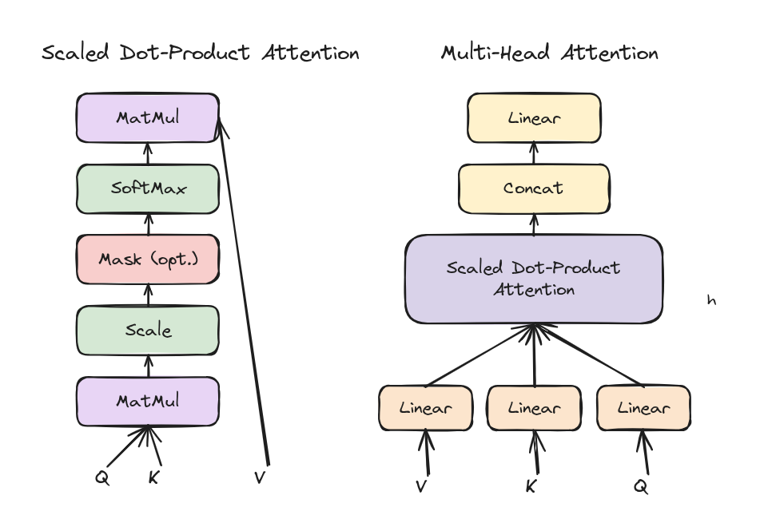
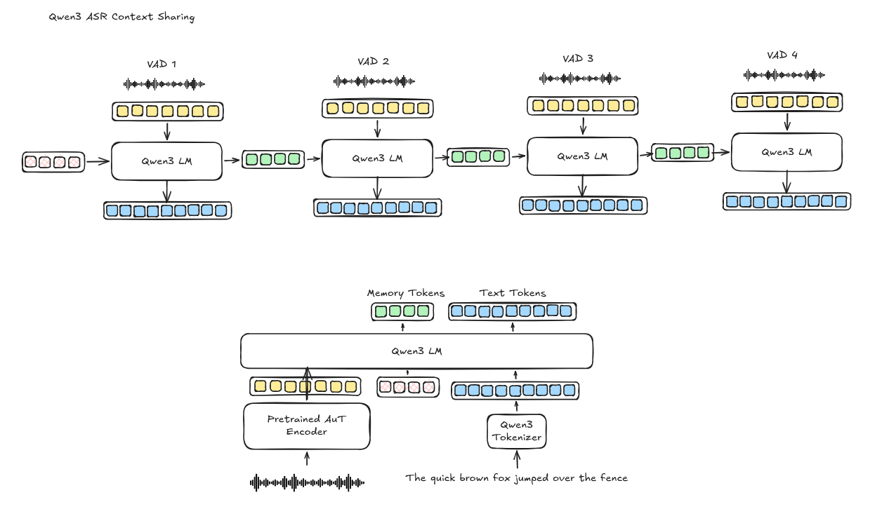
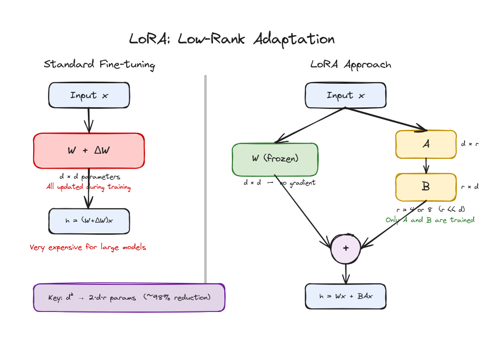

# excaliagent

excaliagent is a CLI tool that gives AI coding agents like [Claude Code](https://claude.com/product/claude-code), [Codex](https://chatgpt.com/codex/), [Cursor CLI](https://cursor.com/cli), [Gemini CLI](https://github.com/google-gemini/gemini-cli) the ability to **read, edit, and create** [Excalidraw](https://github.com/zsviczian/obsidian-excalidraw-plugin) drawings embedded in Obsidian markdown files.

It uses a thin CLI that parses Obsidian's compressed Excalidraw markdown format, decompresses the embedded JSON scene, and exposes high-level commands for inspecting diagram structure and making edits. Most of the code in this project is being written by claude code

## Example Drawings

These diagrams were created entirely using excaliagent skill via Claude Code

| Scaled Dot-Product & Multi-Head Attention | Qwen2 ASR Context Sharing |
|:-:|:-:|
|  |  |

| LoRA Low-Rank Adaptation |
|:-:|
|  |

## Requirements

- Node.js 18+
- [Obsidian](https://obsidian.md/)
- [Obsidian Excalidraw Plugin](https://github.com/zsviczian/obsidian-excalidraw-plugin)

## Installation

### 1. Install the CLI

```bash
git clone https://github.com/anthropics/excaliagent.git
cd excaliagent
npm install
npm run build
npm link   # makes `excaliagent` available globally
```

Without `npm link`, you can run it directly:

```bash
node /path/to/excaliagent/dist/cli.js <command> ...
```

### 2. Install the Claude Code Skill

Copy `SKILL.md` into your Claude Code skills directory so the agent automatically knows how to use the tool when working with Excalidraw files:

```bash
# Create the skills directory if it doesn't exist
mkdir -p ~/.claude/skills

# Copy the skill file
cp SKILL.md ~/.claude/skills/excaliagent.md
```

Alternatively, symlink it so updates to the repo are picked up automatically:

```bash
ln -s "$(pwd)/SKILL.md" ~/.claude/skills/excaliagent.md
```

> **Cursor users**: Place the file at `~/.cursor/skills-cursor/excaliagent/SKILL.md` instead.

Once installed, Claude Code will automatically recognize when you're working with Excalidraw-backed Obsidian notes and use the CLI to read and edit them.

## Commands

### Read

| Command | Description |
|---------|-------------|
| `excaliagent summary <file.md> [--yaml]` | Element counts, groups, texts with IDs, arrows, spatial relations. Omits raw coordinates. |
| `excaliagent element <file.md> <id> [--json]` | All fields for one element, plus `markdownLabel` and `derivedBBox`. |
| `excaliagent scene <file.md> [--no-pretty]` | Full decompressed Excalidraw scene JSON (escape hatch). |

### Write

| Command | Description |
|---------|-------------|
| `excaliagent text set <file.md> <id> "new text"` | Updates label in **both** `## Text Elements` and JSON (required for Obsidian). |
| `excaliagent apply-patch <file.md> <patch.yaml\|.json>` | Declarative shape/arrow/text creation with relative positioning. |

## Patch Format

Patches let you add shapes, arrows, and text declaratively. Positions can be **relative** (to existing elements), **absolute** (pixel coordinates), or default to origin.

```yaml
add:
  # Absolute positioned rectangle with a label inside
  - type: rectangle
    id: boxA0000
    x: 100
    y: 200
    width: 180
    height: 60
    backgroundColor: "#d5e8d4"
    label: "Scale"

  # Relative positioned — centered below boxA0000
  - type: rectangle
    id: boxB0000
    ref: boxA0000
    place: below
    gap: 30
    width: 180
    height: 60
    label: "MatMul"

  # Arrow with auto edge detection
  - type: arrow
    from: boxA0000
    to: boxB0000

  # Arrow with explicit edges
  - type: arrow
    from: boxA0000
    to: boxC0000
    fromEdge: right
    toEdge: left

  # Standalone text
  - type: text
    text: "Q"
    ref: boxB0000
    place: below
    gap: 20
    fontSize: 22
```

### Positioning Modes

| Mode | Fields | Behavior |
|------|--------|----------|
| **Relative** | `ref` + `place` + `gap` | Centered relative to anchor element |
| **Absolute** | `x` + `y` | Pixel coordinates in canvas space |
| **Origin** | _(none)_ | Places at (0, 0) |

`place` values: `below` | `above` | `left-of` | `right-of`

### Supported Shape Properties

- **Rectangle / Ellipse**: `width`, `height`, `id`, `label`, `fontSize`, `backgroundColor`, `strokeColor`, `strokeWidth`, `strokeStyle`, `fillStyle`, `roughness`, `opacity`, `roundness`
- **Arrow**: `from`/`to` (or `start`/`end`), `fromEdge`/`toEdge`, `endArrowhead`, `startArrowhead`
- **Text**: `text` (or `label`), `fontSize`, `textAlign`, plus positioning fields

## Limitations

- **Spatial relations** in `summary` are heuristic (axis-aligned bounding boxes; rotation is approximate)
- **Freedraw**, complex **images/embeddables**, and **collaboration conflicts** are not supported

## Development

```bash
# Run in dev mode (no build step)
npm run dev -- summary ./notes/diagram.md

# Run tests
npm test

# Build the attention diagram example
npm run build:diagram
```

## License

MIT
